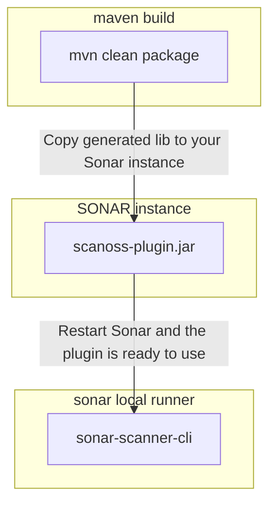

# SCANOSS SONAR PLUGIN - Docker Env Setup

## Introduction

This document contains the instructions to build a development/testing environment from scratch, using Docker.

SONAR PLUGIN: Basics

https://docs.sonarqube.org/latest/extension-guide/developing-a-plugin/plugin-basics/

## Environment Setup

Docker is used when possible to avoid software installation. All components are instantiated or built with Docker containers.

* SONAR installation with the official `sonarqube` image.
* Build plugin's JAR package with the official `maven` image.
* Run Sonar local scanner with the official `sonarsource/sonar-scanner-cli`. Build custom image with scanoss-py if neccesary.  



1. Run Sonar
   This command will spin up a test Sonar installation, listening at port 9000. The default admin user and password credentials are admin:admin

    ```
    docker run -d --name sonarqube -e SONAR_ES_BOOTSTRAP_CHECKS_DISABLE=true -p 9000:9000 sonarqube:latest
    ```

2. Build the SCANOSS Sonar Plugin

    ```
    git clone https://github.com/SonarSource/sonar-custom-plugin-example
    cd sonar-custom-plugin-example
    docker run --rm --platform=linux/amd64 -v $(pwd):/app -w /app -it maven mvn clean package
    ``` 
   
   Notes:
   
   * Depending on maven (and therefore Java version), you may need to change the launch mechanism adding `-Djdk.lang.Process.launchMechanism=vfork`
   * Consider adding `-v maven-repo:/root/.m2` if you want to use a local cache.

3. Copy jar to /opt/sonarqube/extensions/plugins

    ```
    docker cp ./target/*.jar sonarqube:/opt/sonarqube/extensions/plugins/
    ```

4. Restart sonar

    ```
    docker restart sonarqube
    ```

A test Sonar installation and the SCANOSS SONAR plugin are now installed.

## Perform a Scan

We have two options to run the analysis without having the SCANOSS Python CLI on the runner host:

a. Use the `sonar-scanner-cli` Docker image as base to install the SCANOSS Python CLI (`sonar-scanner-cli` base + `scanoss-py`)
b. Use a native installation of the Sonar scanner CLI and

### Option A: Scan using a custom SCANOSS-SONAR-CLI Docker image (sonar-scanner-cli base + scanoss-py)

1. Open the Sonar UI, create a project and generate a token for manual analysis.

2. Build the Docker image present in the repository, you can name it sonar-scanoss-cli.

    ```
    cd sonar-custom-plugin-example
    docker build -t sonar-scanoss-cli .
    ```

3. Run the following command

    ```
    cd my-project
    ```
   
    ```
    export SONARQUBE_URL=host.docker.internal:9000
    export PROJECT_KEY=[YOUR_PROJECT_KEY]
    export myAuthenticationToken=[YOUR_AUTH_TOKEN]
    docker run \
        --rm \
        -e SONAR_HOST_URL="http://${SONARQUBE_URL}" \
        -e SONAR_SCANNER_OPTS="-Dsonar.projectKey=${PROJECT_KEY}" \
        -e SONAR_TOKEN="${myAuthenticationToken}" \
        -v "$(pwd):/usr/src" \
        sonar-scanoss-cli -Dsonar.java.binaries=target
    ```

### Option B: Scan using native builds of the Sonar Scanner but let the plugin use a Docker image for the scanoss-py client.

Pre-requisite: Sonar Scanner CLI

1. Set the SCANOSS Python CLI image name on the SCANOSS UI administration panel.

    Official SCANOSS image name: `ghcr.io/scanoss/scanoss-py:v1.6.0`

2. Run the Sonar Scanner CLI

    ```
    sonar-scanner -Dsonar.login=[AUTH_TOKEN] -Dsonar.projectKey=[PROJECT_KEY] -Dsonar.host.url=http://localhost:9000
    ```