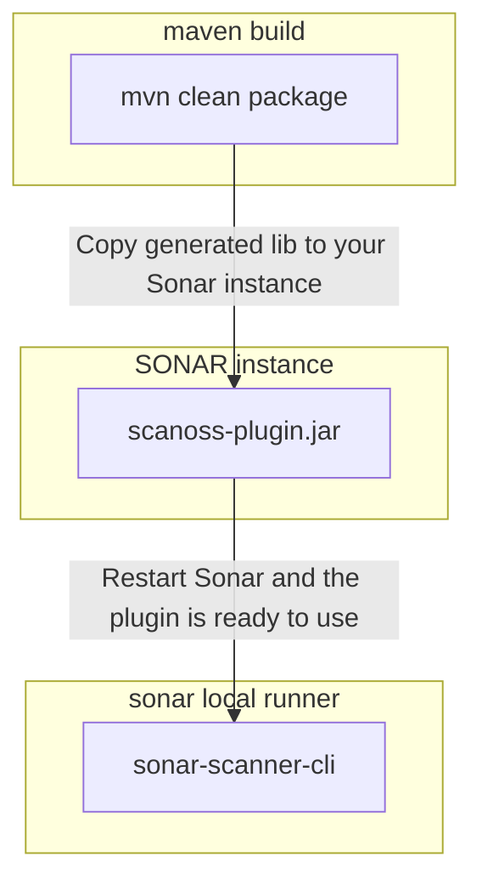

# SCANOSS SONARQUBE PLUGIN - Docker Env Setup

## Introduction

This document contains the instructions to build a development/testing environment from scratch, using Docker.

SONAR PLUGIN: Basics

https://docs.sonarqube.org/latest/extension-guide/developing-a-plugin/plugin-basics/

## Environment Setup

Docker is used when possible to avoid software installation. All components are instantiated or built with Docker containers.

* SonarQube installation with the official `sonarqube` image.
* Build plugin's JAR package with the official `maven` image.
* Run SonarQube local scanner with the official `sonarsource/sonar-scanner-cli`.  



1. Run Sonar
   This command will spin up a test Sonar installation, listening at port 9000. The default admin user and password credentials are admin:admin

    ```
    docker run -d --name sonarqube -p 9000:9000 sonarqube:latest
    ```

2. Build the SCANOSS Sonar Plugin

    ```
    git clone https://github.com/SonarSource/sonar-custom-plugin
    cd sonar-custom-plugin
    docker run --rm -v $(pwd):/app -w /app -it maven mvn clean package
    ``` 
   
   Notes:
   
   * Depending on maven (and therefore Java version), you may need to change the launch mechanism adding `-Djdk.lang.Process.launchMechanism=vfork`
   * Consider adding `-v maven-repo:/root/.m2` if you want to use a local cache.

3. Copy jar to /opt/sonarqube/extensions/plugins

    ```
    docker cp ./target/*.jar sonarqube:/opt/sonarqube/extensions/plugins/
    ```

4. Restart sonar

    ```
    docker restart sonarqube
    ```

A test Sonar installation and the SCANOSS SONARQUBE plugin are now installed.

## Run Scan
Run the following commands
   ```
   cd my-project
   ```
   
   ```
   export SONARQUBE_URL=host.docker.internal:9000
   export PROJECT_KEY=[PROJECT_KEY]
   export myAuthenticationToken=[AUTH_TOKEN]
   docker run \
       --rm \
       --add-host=host.docker.internal:host-gateway \
       -e SONAR_HOST_URL="http://${SONARQUBE_URL}" \
       -e SONAR_SCANNER_OPTS="-Dsonar.projectKey=${PROJECT_KEY}" \
       -e SONAR_TOKEN="${myAuthenticationToken}" \
       -v "$(pwd):/usr/src" \
       sonarsource/sonar-scanner-cli -Dsonar.java.binaries=target    
   ```
